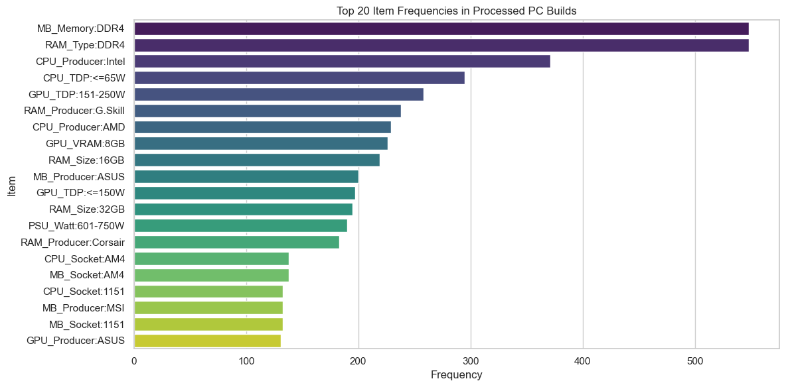
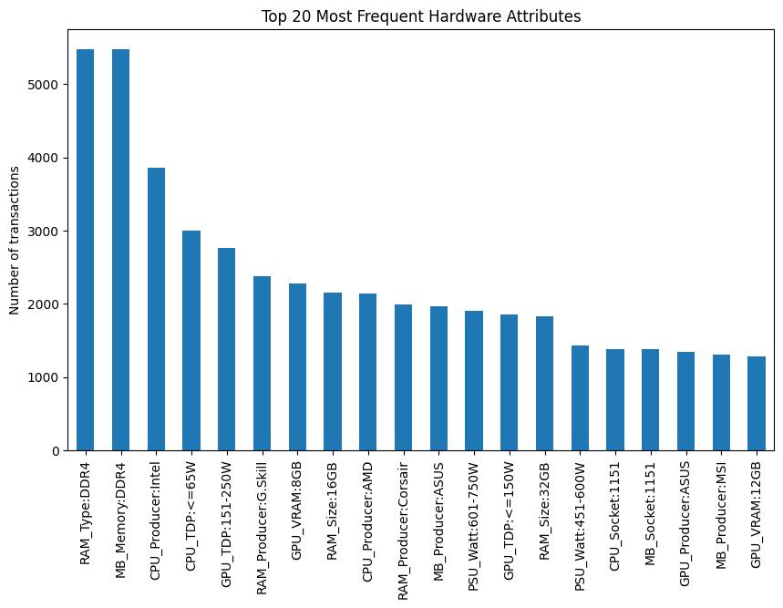
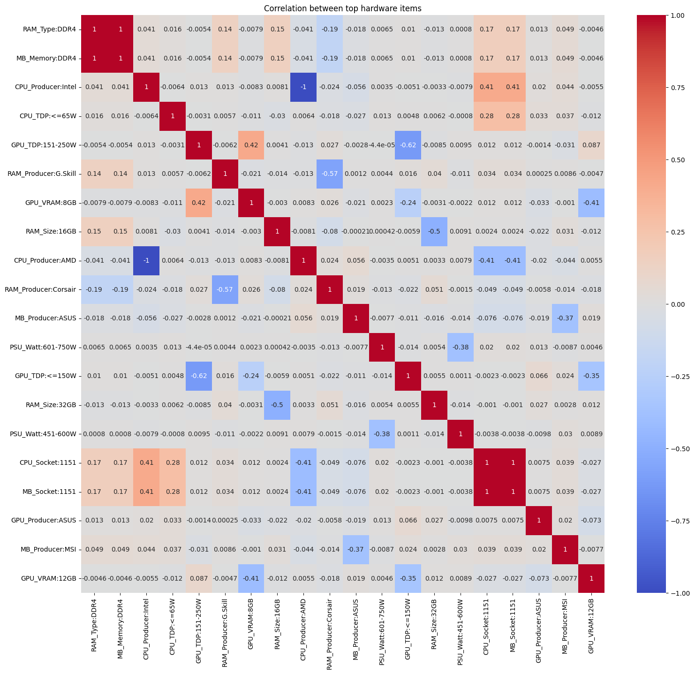
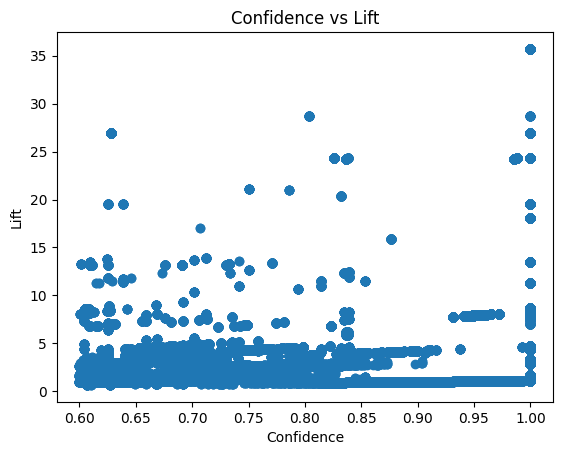

# Association Rule Mining for PC Component Compatibility
**CSC172 Data Mining and Analysis Final Project**  
*Mindanao State University - Iligan Institute of Technology*  
**Student:** Chris Adrian D. Gumisad, 2020-3275  
**Semester:** AY 2025-2026 Sem 1  

## Abstract
This project applies the Apriori algorithm to discover compatibility and co-occurrence patterns among PC components such as CPU, GPU, RAM, motherboard, and power supply unit (PSU). Using a public hardware specifications dataset augmented with realistic compatible PC builds, component attributes are transformed into transactional itemsets. Association rule mining is then performed to identify strong relationships, including CPU socket ↔ motherboard chipset, RAM type ↔ motherboard memory support, and GPU power requirements ↔ PSU wattage. The workflow consists of data preprocessing, exploratory data analysis (EDA), rule generation, and evaluation using support, confidence, lift, leverage, and conviction.

## Table of Contents
- [Abstract](#abstract)
- [1. Introduction](#1-introduction)
  - [1.1 Problem Statement](#11-problem-statement)
  - [1.2 Objectives](#12-objectives)
  - [1.3 Scope and Limitations](#13-scope-and-limitations)
- [2. Dataset Description](#2-dataset-description)
  - [2.1 Source and Acquisition](#21-source-and-acquisition)
  - [2.2 Data Structure](#22-data-structure)
  - [2.3 Sample Transactions](#23-sample-transactions)
- [3. Methodology](#3-methodology)
  - [3.1 Data Preprocessing](#31-data-preprocessing)
  - [3.2 Exploratory Data Analysis](#32-exploratory-data-analysis)
  - [3.3 Apriori Algorithm Implementation](#33-apriori-algorithm-implementation)
  - [3.4 Evaluation Metrics](#34-evaluation-metrics)
- [4. Results](#4-results)
  - [4.1 Top Association Rules](#41-top-association-rules)
  - [4.2 Key Visualizations](#42-key-visualizations)
  - [4.3 Performance Metrics](#43-performance-metrics)
- [5. Discussion](#5-discussion)
  - [5.1 Business Insights](#51-business-insights)
  - [5.2 Actionable Recommendations](#52-actionable-recommendations)
  - [5.3 Limitations](#53-limitations)
- [6. Conclusion](#6-conclusion)
- [7. Video Presentation](#7-video-presentation)
- [References](#references)
- [Appendix: Full Results](#appendix-full-results)

## 1. Introduction
### 1.1 Problem Statement
Building a compatible PC requires careful matching of components based on technical constraints such as CPU socket type, supported memory standards, and power requirements. Errors in component selection can lead to incompatibility, inefficiency, or hardware failure. This project addresses the problem by discovering hidden compatibility patterns in PC component data using association rule mining.
### 1.2 Objectives
- Preprocess PC hardware specifications for association analysis
- Apply one-hot encoding and item filtering for association analysis
- Implement the Apriori algorithm to extract strong rules
- Evaluate rules using support, confidence, lift, leverage, and conviction
- Identify meaningful compatibility and co-occurrence patterns

### 1.3 Scope and Limitations
**Scope:** 
  - Attribute-based association rule mining
  - Focus on CPU, motherboard, RAM, GPU, and PSU compatibility
  - Apriori algorithm using the mlxtend library
**Limitations:** 
  - Dataset is not natively transactional and requires transformation
  - Continuous attributes must be binned (e.g., wattage, TDP)
  - No temporal, pricing, or performance benchmarking analysis

## 2. Dataset Description
### 2.1 Source and Acquisition
**Source:** General Computer Hardware Dataset – Kaggle (https://www.kaggle.com/datasets/dilshaansandhu/general-computer-hardware-dataset)
**Augmentation:** Realistic compatible PC build transactions generated based on known hardware constraints
**Contents:** CPU, GPU, RAM, Motherboard, PSU  
**Size:** 6,000 compatible PC build transactions, 189 unique items, 132 filtered items (support > 0.01)
**Item Encoding:** Attribute-based (e.g., CPU_Socket:AM4, RAM_Type:DDR4)

### 2.2 Data Structure
Attributes were converted into categorical items such as:

- CPU_Producer, CPU_Socket, CPU_TDP
- MB_Producer, MB_Socket, MB_Chipset, MB_Memory
- RAM_Type, RAM_Size
- GPU_Producer, GPU_VRAM, GPU_TDP
- PSU_Watt

Each transaction represents a complete compatible PC build.

### 2.3 Sample Transactions
Transaction 1: ['CPU_Producer:Intel', 'CPU_Socket:1200', 'CPU_TDP:96-125W',
 'MB_Producer:ASUS', 'MB_Socket:1200', 'MB_Chipset:Z590', 'MB_Memory:DDR4',
 'RAM_Producer:Crucial', 'RAM_Type:DDR4', 'RAM_Size:16GB',
 'GPU_Producer:EVGA', 'GPU_VRAM:8GB', 'GPU_TDP:151-250W',
 'PSU_Producer:Xilence', 'PSU_Watt:451-600W']

Transaction 2: ['CPU_Producer:AMD', 'CPU_Socket:AM4', 'CPU_TDP:<=65W',
 'MB_Producer:MSI', 'MB_Socket:AM4', 'MB_Chipset:B550', 'MB_Memory:DDR4',
 'RAM_Producer:G.Skill', 'RAM_Type:DDR4', 'RAM_Size:16GB',
 'GPU_Producer:Gigabyte', 'GPU_VRAM:6GB', 'GPU_TDP:<=150W',
 'PSU_Producer:PHANTEKS', 'PSU_Watt:901-1200W']

## 3. Methodology

### 3.1 Data Preprocessing
1. **Missing Value Handling:** Removed incomplete and invalid component combinations
2. **One-Hot Encoding:** Converted to 6,000 × 132 binary transaction matrix
3. **Item Filtering:** Generated compatibility of hardware with unique 189 items (support > 0.01) → 9,708 × 132 matrix
4. **Final Dataset:** 6,000 transactions × 50 items (92.0% sparsity reduced to manageable size)

**Before/After Statistics:**
| Metric | Raw Data | Merged Data | One-hot encoding |
|--------|----------|----------------|----------------|
| Transactions | 5,901 | 6000 | 6000 |
| Unique Items | 77 | 15 | 189|
| Density | - | - | 11.17% |

### 3.2 Exploratory Data Analysis
- **Most frequent items:** MB_Memory:DDR4 , RAM_Type:DDR4, CPU_Producer:Intel
- **Most common memory standard:** DDR4
- **Basket Size:** Mean items per transaction: 15, Min: 15, Max: 15
- **Co-occurrence:** MB_Memory:DDR4 and MB_Memory:DDR4 appears 91.5% in top 25

### 3.3 Apriori Algorithm Implementation
**Implementation:** mlxtend.frequent_patterns.apriori() with association_rules()
- Parameters:
  - min_support = 0.02
  - min_confidence = 0.6
  - min_lift = 1.2

### 3.4 Evaluation Metrics
- **Support:** \( \frac{\text{support}(A \cup B)}{N} \) - Frequency of itemsets
- **Confidence:** \( \frac{\text{support}(A \cup B)}{\text{support}(A)} \) - Rule reliability
- **Lift:** \( \frac{\text{confidence}(A \to B)}{\text{support}(B)} \) - Strength of association (>1 indicates positive dependency)
- **Leverage:**  \[\text{Leverage}(A \rightarrow B) = \text{Support}(A \cup B) - \text{Support}(A)\text{Support}(B)\] - Difference from expected independence
- **Conviction:**  \[\text{Conviction}(A \rightarrow B) = \frac{1 - \text{Support}(B)}{1 - \text{Confidence}(A \rightarrow B)}\] - Directional implication strength

## 4. Results
### 4.1 Top Association Rules

| Rank | Antecedents        | Consequents        | Support | Confidence | Lift  | Conviction | Leverage |
| ---- | ------------------ | ------------------ | ------- | ---------- | ----- | ---------- | -------- |
| 1    | MB_Chipset:A88X    | CPU_Socket:FM2+    | 0.053   | 1.0        | 18.75 | inf        | 0.050    |
| 2    | CPU_Socket:FM2+    | MB_Chipset:A88X    | 0.053   | 1.0        | 18.75 | inf        | 0.050    |
| 3    | CPU_Socket:FM2+    | MB_Socket:FM2+     | 0.053   | 1.0        | 18.75 | inf        | 0.050    |
| 4    | MB_Socket:FM2+     | CPU_Socket:FM2+    | 0.053   | 1.0        | 18.75 | inf        | 0.050    |
| 5    | MB_Socket:FM2+     | MB_Chipset:A88X    | 0.053   | 1.0        | 18.75 | inf        | 0.050    |
| 6    | MB_Chipset:A88X    | MB_Socket:FM2+     | 0.053   | 1.0        | 18.75 | inf        | 0.050    |
| 7    | RAM_Type:DDR5      | MB_Memory:DDR5     | 0.087   | 1.0        | 11.54 | inf        | 0.079    |
| 8    | MB_Memory:DDR5     | RAM_Type:DDR5      | 0.087   | 1.0        | 11.54 | inf        | 0.079    |
| 9    | MB_Socket:1200     | CPU_Socket:1200    | 0.115   | 1.0        | 8.70  | inf        | 0.102    |
| 10   | CPU_Socket:1200    | MB_Socket:1200     | 0.115   | 1.0        | 8.70  | inf        | 0.102    |
| 11   | CPU_Socket:2011-V3 | MB_Socket:2011-V3  | 0.118   | 1.0        | 8.45  | inf        | 0.104    |
| 12   | MB_Chipset:X99     | CPU_Socket:2011-V3 | 0.105   | 1.0        | 8.45  | inf        | 0.093    |
| 13   | CPU_Socket:2011-V3 | MB_Chipset:X99     | 0.105   | 0.887      | 8.45  | 7.94       | 0.093    |
| 14   | MB_Socket:2011-V3  | CPU_Socket:2011-V3 | 0.118   | 1.0        | 8.45  | inf        | 0.104    |
| 15   | MB_Chipset:X99     | MB_Socket:2011-V3  | 0.105   | 1.0        | 8.45  | inf        | 0.093    |
| 16   | MB_Socket:2011-V3  | MB_Chipset:X99     | 0.105   | 0.887      | 8.45  | 7.94       | 0.093    |
| 17   | MB_Socket:1700     | CPU_Socket:1700    | 0.127   | 1.0        | 7.89  | inf        | 0.111    |
| 18   | CPU_Socket:1700    | MB_Socket:1700     | 0.127   | 1.0        | 7.89  | inf        | 0.111    |
| 19   | CPU_Socket:1151    | MB_Socket:1151     | 0.222   | 1.0        | 4.51  | inf        | 0.173    |
| 20   | MB_Socket:1151     | CPU_Socket:1151    | 0.222   | 1.0        | 4.51  | inf        | 0.173    |
| 21   | MB_Chipset:B550    | MB_Socket:AM4      | 0.050   | 1.0        | 4.35  | inf        | 0.039    |
| 22   | MB_Socket:AM4      | CPU_Socket:AM4     | 0.230   | 1.0        | 4.35  | inf        | 0.177    |
| 23   | MB_Chipset:B550    | CPU_Socket:AM4     | 0.050   | 1.0        | 4.35  | inf        | 0.039    |
| 24   | CPU_Socket:AM4     | MB_Socket:AM4      | 0.230   | 1.0        | 4.35  | inf        | 0.177    |
| 25   | MB_Chipset:A88X    | MB_Producer:ASUS   | 0.053   | 1.0        | 3.00  | inf        | 0.036    |

### 4.2 Key Visualizations

 

### 4.3 Performance Metrics
| Stage           | Time (s)  |
| --------------- | --------- |
| Preprocessing   | 20.42     |
| Rule Generation | 1.29      |
| **Total**       | **30.72** |

Scalability: Handles 6000 transactions on standard laptop

## 5. Discussion

### 5.1 Business Insights (System Builders / Integrators)
- CPU–motherboard socket rules show near-perfect confidence, validating industry standards
- DDR4 and DDR5 memory rules reflect generational hardware transitions
- GPU TDP ↔ PSU wattage rules support power budgeting during system design

### 5.2 Actionable Recommendations
- Automated compatibility checking for PC configurators
- PSU upsell recommendations based on GPU power tier
- Error prevention by blocking incompatible component selections

### 5.3 Limitations
- Synthetic transaction generation may introduce bias
- Binary encoding ignores quantities and pricing
- Results reflect compatibility, not performance optimization

## 6. Conclusion
This study demonstrates that association rule mining using the Apriori algorithm can effectively extract meaningful compatibility knowledge from PC hardware specifications. The discovered rules align with real-world system-building constraints and can support recommendation systems, automated validators, and retail decision-making. Future work may include FP-Growth comparison, performance-aware rules, and real customer transaction data.

## 7. Video Presentation
  
*5-minute demo: Problem → Dataset → Methods → Key Findings → Business Insights*

## References
1. Agrawal, R., & Srikant, R. (1994). Fast Algorithms for Mining Association Rules. VLDB.
2. mlxtend Documentation: https://rasbt.github.io/mlxtend/
3. General Computer Hardware Dataset: (https://www.kaggle.com/datasets/dilshaansandhu/general-computer-hardware-dataset)

## Appendix: Full Results
**Complete rules CSV:** [results/rules_top25.csv](results/rules_top25.csv)  

